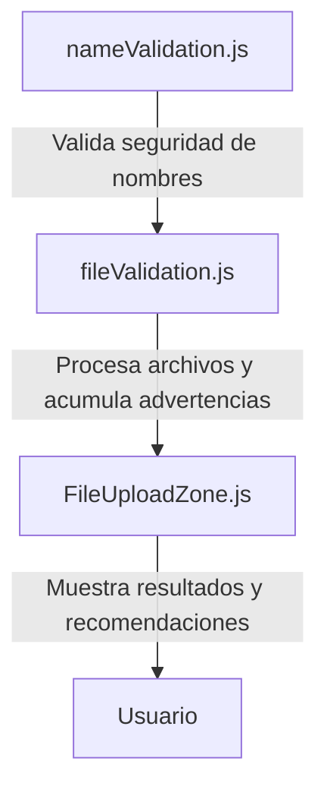

# [IMPLEMENTED] Arquitectura del Sistema de Validación

## Flujo General

El sistema de validación de Coggni Cobranzas sigue un flujo estricto de seguridad y validación de datos:

1. **nameValidation.js**
   - Realiza validaciones de seguridad sobre los nombres de contacto (scripts, SQL, URLs, emojis, etc.)
   - Expone la función `validateContactNameSecurity()` para uso en el procesamiento de archivos

2. **fileValidation.js**
   - Procesa archivos de contactos y facturas
   - Integra la validación de nombres llamando a `validateContactNameSecurity()` para cada registro
   - Acumula advertencias y estadísticas de riesgo
   - Genera reportes detallados para el usuario

3. **FileUploadZone.js**
   - Componente React que permite subir archivos y muestra resultados de validación
   - Presenta advertencias generales y una sección específica para nombres sospechosos
   - Ofrece recomendaciones y desglose de riesgos

## Diagrama de Componentes

## Decisiones de Diseño

- **Seguridad primero:** La validación de nombres prioriza la detección de amenazas (scripts, SQL, URLs) sobre la limpieza comercial.
- **Separación de responsabilidades:** Cada archivo tiene una función clara (utilidad, procesamiento, UI).
- **Extensibilidad:** El sistema permite agregar nuevas validaciones fácilmente siguiendo la arquitectura modular.
- **Transparencia para el usuario:** El UI muestra detalles y recomendaciones, no solo advertencias genéricas.

## Resumen

El flujo implementado garantiza que los datos sean validados de forma segura antes de ser procesados o mostrados, y que el usuario reciba información clara sobre cualquier riesgo detectado. 